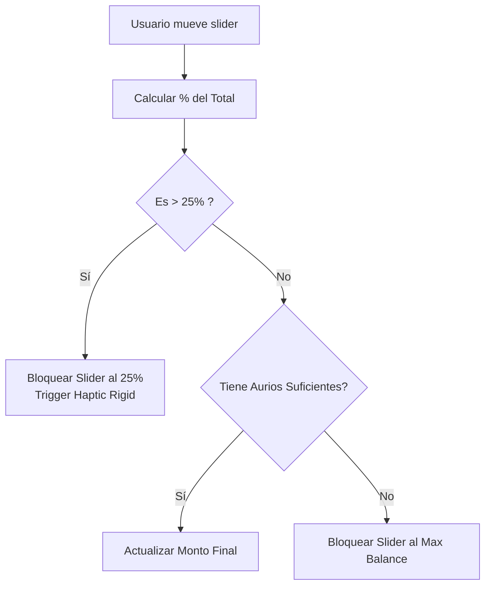

# Chakana Hackathon MVP — Dev 2: Frontend Mobile Logic

**Rol:** Arquitectura de estado, validaciones matemáticas y conexión con backend.

## 1. División de Trabajo (Humano vs IA)
- **IA (Vibe Coding):** Creación del boilerplate del Store de Zustand, escritura de types/interfaces en TypeScript, mocks de datos y setup del cliente de Supabase.
- **Humano:** Diseño de la máquina de estados, lógica del "Checkout Slider" (límites y porcentajes), manejo de excepciones (Edge cases y timeouts) y paso de datos limpios al Dev 3.

## 2. Arquitectura de Estado (Diagrama de Componentes)

```mermaid
graph TD
    A[UI Components (Dev 1)] -->|Lectura/Escritura| B((Zustand AppStore))
    B --> C{State Slices}
    
    C -->|User Slice| D[Wallet PubKey, Aurios Balance]
    C -->|Business Slice| E[Tambu Activo, Datos del Local]
    C -->|UI Slice| F[Loading Spinner, Modals State]
    
    B -->|Persistencia Opcional| G[(AsyncStorage / localStorage)]
```

## 3. Lógica Crítica: Slider de Descuento
El slider no es un simple input UI, implementa las Tokenomics de Chakana:
- `Total = $10.00`
- `Aurios Disp = 1200` (=$12.00)
- `Max Permitido = 25% del Total` (=$2.50 = 250 Aurios)

**Diagrama de Flujo (Lógica del Slider):**


## 4. Mejores Prácticas (Zustand & Supabase en Expo)
- **Supabase en RN:** Debes usar el polyfill de URL y el localStorage adapter de `expo-sqlite` para que la autenticación/sesión funcione correctamente en el móvil.
- **Zustand:** Usa la sintaxis recomendada por la doc de `pmndrs/zustand` para React Native.
```typescript
import { create } from 'zustand'
interface AppState {
  aurioBalance: number;
  updateBalance: (newBalance: number) => void;
}
export const useAppStore = create<AppState>()((set) => ({
  aurioBalance: 0,
  updateBalance: (balance) => set({ aurioBalance: balance }),
}));
```