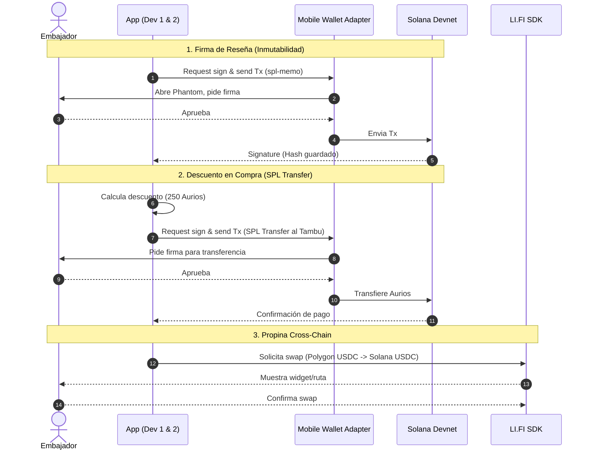

# Chakana Hackathon MVP — Dev 3: Web3 / Crypto

**Rol:** Conexión de wallets móviles, transacciones Solana (Memo y SPL Token) y puente cross-chain con LI.FI.

## 1. División de Trabajo (Humano vs IA)
- **IA (Vibe Coding):** Boilerplate de `@solana/web3.js`, configuración de RPC (Devnet), UI wrapper básico para el LI.FI widget.
- **Humano:** Inicialización de `Mobile Wallet Adapter` (complejo en Expo), firmado correcto de transacciones de SPL Token (`transfer`) y parseo de respuestas de la blockchain.

## 2. Diagrama de Secuencia Web3

## 3. Mecánicas Web3 Clave
- **SPL Token:** No usamos el token program de 2022 a menos que sea necesario. Usa `@solana/spl-token` estándar.
- **Transacción de Descuento:** A diferencia del plan anterior, **NO usamos burn**. Construimos un `SystemProgram` transfer o un Token Transfer que mueva los Aurios de la `PublicKey` del Embajador a la `PublicKey` del Tambu.
- **Mobile Wallet Adapter:** Requiere Expo Prebuild y probar en Android físico o emulador. No funciona en Expo Go.

## 4. Prácticas LI.FI
- Usar el LI.FI SDK (`getRoutes`, `executeRoute`) es ideal para apps custom, pero si el tiempo apremia (Hackathon), integrar el **LI.FI Widget** web-viewizado ahorra horas de UI.