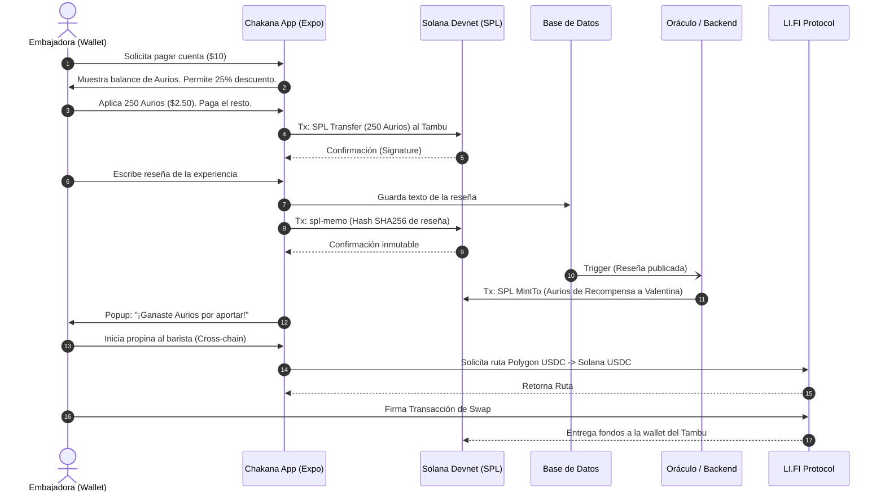
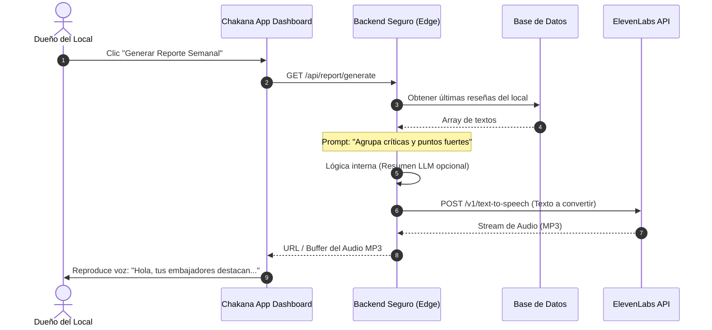

# Chakana Hackathon MVP — Documento de Diseño Técnico

**Versión:** 1.0 (Hackathon Edition)  
**Propósito:** Definir la arquitectura, casos de uso y diagramas de flujo para que el equipo de desarrollo entienda el problema, las mecánicas Web3 y los límites del MVP de 48 horas antes de tirar líneas de código.

---

## 1. Especificación de Requisitos del Sistema (SRS - MVP)

### 1.1 Contexto
Chakana es un ecosistema de economía circular. Para este MVP, demostraremos el **Caso de Uso de Reciprocidad**: un Embajador consume en un Tambu local, aplica un descuento usando tokens, deja una reseña inmutable, gana nuevos tokens por su aporte, y recompensa al personal con una propina cross-chain. El Tambu, a su vez, usa IA para analizar su feedback.

### 1.2 Stack Tecnológico
- **Frontend App:** React Native (Expo Prebuild) para iOS/Android.
- **Web3 / Blockchain:** Solana Devnet.
  - `@solana-mobile/mobile-wallet-adapter-protocol` (Conexión de wallet nativa).
  - `@solana/spl-token` (Creación, Transferencia y Acuñación de Aurios).
  - `@solana/spl-memo` (Registro inmutable del hash de la reseña).
- **Backend / Database:** Supabase (Auth, Postgres para guardar el texto de reseñas) + Edge Functions/NestJS (Oráculo seguro para mintear tokens y ocultar API keys).
- **Integraciones Hackathon:**
  - **LI.FI SDK:** Propinas cross-chain.
  - **ElevenLabs API:** Conversión de reseñas a reportes de voz (TTS).

### 1.3 Mecánica Económica (Aurios SPL Token)
- **El Aurio ($A):** 1 Aurio equivale a $0.01 USD de descuento interno.
- **Acreditación (Mint):** Cuando un Embajador aporta valor verificable (ej. publica una reseña de >50 caracteres), el Backend Oráculo acuña (`mintTo`) Aurios directamente a la wallet del usuario en Devnet.
- **Canje (Transfer):** En su próxima compra, el Embajador puede descontar hasta un 25% de su cuenta transfiriendo sus Aurios al Tambu (`transfer`).
- **Valor para el Tambu:** El Tambu no se empobrece. Recibe los Aurios del cliente y luego, en una fase posterior (B2B), los "quema" (`burn`) para descontarse dinero real en los paquetes de suscripción que le paga a la plataforma Gavanti.

---

## 2. Casos de Uso Core (MVP)

### CU-01: Pago Físico con Descuento (Economía Circular)
- **Actor:** Embajador (Usuario).
- **Descripción:** El usuario pide un café por la app o presencial. Al momento de pagar la cuenta (ej. $10.00), decide usar 250 Aurios para descontar $2.50.
- **Flujo Técnico:** La app construye una transacción Solana. Llama a la instrucción `transfer` del contrato SPL Token, enviando 250 Aurios de la wallet del usuario a la wallet del Tambu. El usuario aprueba en Phantom. El sistema valida la tx y marca el pedido como "Pagado con descuento".

### CU-02: Reseña y Recompensa (Acreditación)
- **Actor:** Embajador.
- **Descripción:** Tras consumir, el usuario deja una calificación y texto de su experiencia.
- **Flujo Técnico:** 
  1. El front guarda el texto crudo en Supabase.
  2. Genera un hash SHA256 del texto y lo ancla a Solana usando `spl-memo`.
  3. Supabase emite un webhook al Oráculo Backend. El Oráculo verifica la autenticidad y ejecuta una tx `mintTo` minteando Aurios recompensa hacia el usuario.

### CU-03: Propina Cross-Chain (LI.FI)
- **Actor:** Embajador.
- **Descripción:** El usuario quiere dejar una propina de agradecimiento al barista, pero solo tiene saldo en Polygon.
- **Flujo Técnico:** Se renderiza un widget/UI del SDK de LI.FI. El usuario selecciona Polygon USDC -> Solana USDC. Firma la transacción de swap+bridge y el barista recibe la propina en Solana.

### CU-04: Reporte Ejecutivo IA de Mejoras (ElevenLabs)
- **Actor:** Tambu (Dueño de negocio).
- **Descripción:** El dueño entra a su dashboard para saber cómo le fue en la semana, pero en vez de leer, escucha.
- **Flujo Técnico:** El dueño pulsa "Generar Reporte". El frontend llama al Endpoint protegido. El Endpoint extrae las últimas reseñas de Supabase, las inyecta en un prompt a un LLM para hacer un resumen crítico, y envía el resumen a la API de ElevenLabs. ElevenLabs retorna un stream de audio que se reproduce en la app.

---

## 3. Diagramas de Secuencia

### Diagrama 1: Flujo del Embajador (Consumo, Descuento y Recompensa)

### Diagrama 2: Flujo del Tambu (Feedback IA con ElevenLabs)

